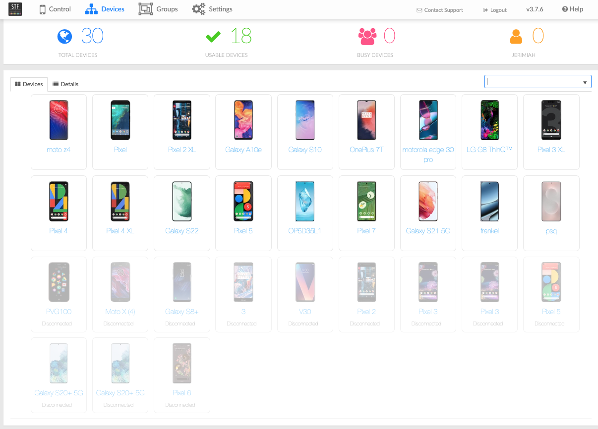
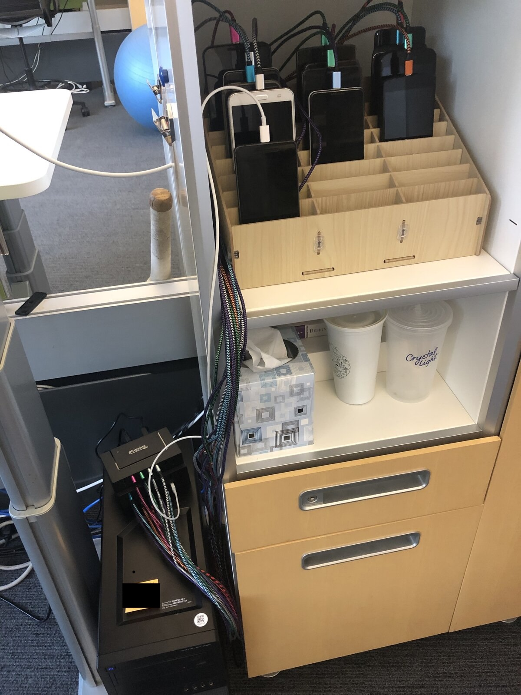

# Building Device Farms with STF: A 9-Year Journey and Gift to the Community

*Six years in production, tested during a pandemic, and now available as a starter template*

## The Beginning (2016)

I built my first on-premises Android device farm in 2016. At the time, cloud-based device testing services were expensive, and privacy concerns around sending our pre-release builds to third-party services weighed heavily on our decision-making. I discovered [Smartphone Test Farm (STF)](https://github.com/DeviceFarmer/stf) and immediately saw its potential—not just as a testing tool, but as a complete solution for remote device access and management.

That first implementation taught me invaluable lessons about distributed systems, Android debugging, and the unique challenges of managing physical hardware at scale.

## The Second Time Around (2019)

In 2019, I joined a new company and immediately knew we needed a device farm. Armed with three years of experience, I built our second STF deployment from scratch. This time, I refined the approach based on everything I'd learned.

The architecture was different from the official documentation's systemd-based approach. I chose Docker Compose with a distributed setup:
- **Central server** hosting the web UI, database, and core services
- **Remote providers** deployed on machines across the office with USB-connected devices
- **SSL/TLS** throughout for security
- **Custom device database** for better device metadata and images

## The Ultimate Test: COVID-19 (2020-2022)

Then came the real validation of this architecture.

In March 2020, our entire company went remote. Suddenly, the device farm wasn't just convenient—it was essential. Developers working from home needed access to physical devices they couldn't keep at their houses. QA engineers couldn't walk to the device rack. Everyone was remote, but the devices weren't.

**The device farm kept working.**

The distributed architecture I'd built meant devices could be accessed from anywhere with a web browser. Developers in home offices could grab a device, run their tests, and release it back to the pool. QA could execute test plans remotely. CI pipelines kept running. For two years of remote work, that device farm was one of the few things that didn't change.

That's when I knew this setup was worth more than just internal value—it was worth sharing with the community.

## Six Years in Production and Counting

It's now 2025, and that device farm is still running strong. What started as a tool for the QA team became essential infrastructure for the entire company:

- **Developers** use it for debugging on real devices without leaving their desks
- **QA engineers** run manual test passes across dozens of device models
- **Product managers** demo features on specific devices for stakeholders
- **Marketing** captures screenshots and videos for app store listings
- **Support teams** reproduce customer issues on exact device models
- **CI/CD systems** run automated tests in parallel across our device fleet

The infrastructure has proven itself not just in normal times, but during the extraordinary disruption of a global pandemic. That's the kind of reliability you can build on.

*The STF web interface - 18+ devices accessible from any browser*

## The Economics: Why This Makes Sense

Let's talk numbers, because the financial case for on-premises device testing is compelling.

### Initial Investment (One-Time)

For our current 18-device setup:

| Item | Cost | Notes |
|------|------|-------|
| 18 used phones @ ~$200 avg | $3,600 | Mix of flagships with cosmetic damage |
| 3x Pluggable USB hubs | $150 | Powered hubs, ~$50 each |
| Phone storage rack | $15 | Temu special |
| Dell tower (used) | $200 | 14 years old, still running |
| **Total Hardware** | **$3,965** | |

Add the central server VM (IT already had capacity, so $0 incremental), and we're at roughly **$4,000 total**.

### Operating Costs (Annual)

- **Electricity**: ~$50/year (devices in low-power state most of the time)
- **Bandwidth**: $0 (internal network)
- **Maintenance**: ~$100/year (occasional battery replacement for older devices, USB cables)
- **Software**: $0 (STF is open source)
- **Total Annual**: **~$150/year**

### Cloud Service Comparison

For teams with high usage, cloud providers offer unlimited plans around **$250/month per device**. You pay for concurrent device slots, not your total fleet.

For our usage pattern, we'd need roughly **6 concurrent devices** (two test runs happening simultaneously, using 3 devices each):

- 6 devices × $250/month = **$1,500/month**
- $1,500/month × 12 months = **$18,000/year**

### The Payback Period

- **On-premises**: $4,000 initial + $150/year
- **Cloud unlimited**: $18,000/year

**Payback period: About 3 months.**

After 6 years of operation:
- **On-premises total cost**: $4,000 + ($150 × 6) = **$4,900**
- **Cloud cost (same period)**: $18,000 × 6 = **$108,000**

**Savings: ~$103,000** over 6 years.

And here's the kicker: with our on-premises setup, we have **18 devices available**, not just 6. When we need to scale up test runs, add more device variety, or let multiple teams work simultaneously, we can—at no additional cost.

### Beyond the Numbers

The economics are compelling, but there are benefits you can't easily quantify:

- **Privacy**: Pre-release builds never leave your network. No third party sees your code, features, or user data.
- **Availability**: No queue times, capacity constraints, or rate limits.
- **Flexibility**: Need to test on a specific device model? Buy it, plug it in, test tomorrow.
- **Control**: No service degradation, no surprise price increases, no dependency on external vendors.
- **Parallelization**: Run tests on 20 devices simultaneously, 24/7, for no additional cost.

Once you've made the initial hardware investment, you can test on devices in parallel as often as you want—for free. No per-minute charges, no monthly subscriptions, no usage limits. Just real devices, always available.

## The Reality: Commodity Hardware and Real Challenges

Now that you understand the value, let's talk about what this actually looks like in practice—because it's not fancy.

The central server? A virtual machine managed by our IT department. Nothing special, just a standard VM running Docker.

The devices? They're connected to a **14-year-old Dell tower** sitting in our office with **three Pluggable-brand powered USB hubs**. No expensive server racks, no enterprise hardware. Just commodity equipment that works.

Device storage was another challenge that took me years to solve. I tried various approaches before settling on a simple **phone storage/repair rack from Temu for $15**. It keeps devices organized, visible, and accessible. Sometimes the best solutions are the cheapest ones.

*The setup: 14-year-old Dell tower, three Pluggable USB hubs, and a $15 Temu phone rack*

### The Battery Problem (and Solution)

But running physical devices 24/7 presents real challenges. The biggest one? **Batteries.**

For years, the constant charging degraded device batteries. Every two years, like clockwork, I'd notice devices with swollen batteries pushing their screens out. I'd have to order replacement batteries, carefully disassemble phones, and swap them out. It was tedious, time-consuming, and frankly a bit scary (swollen lithium batteries are no joke).

Then Android 12 changed everything.

The **charge limiting feature** lets you cap charging at 80%, which dramatically reduces battery stress. I enabled it on every device running Android 12 or newer. The results? **I haven't replaced a single battery on an Android 12+ device.** Not one. Devices that have been plugged in continuously for 2+ years still have healthy batteries.

This is the kind of operational detail you don't see in cloud testing services—they hide it. But when you run your own farm, you deal with the reality of physical hardware. And sometimes, a simple OS feature solves a years-long problem.

## Device Selection: Diversity Over Uniformity

One of the biggest advantages of running your own farm is choosing exactly which devices to support. My philosophy? **Wide diversity of manufacturers.**

Don't just buy Pixels and Galaxies. Get OnePlus, Motorola, LG, Huawei, and other brands. Real users have diverse devices, and your tests should reflect that.

**Be cautious with Xiaomi/Redmi.** I learned this the hard way. Their phones can be extremely locked down—even with developer mode enabled, ADB connections trigger a modal dialog every time, and some models require a SIM card to work properly. Not worth the headache.

Here's something most people don't realize: **the phone encodes and streams the video in real-time during remote use.** This has practical implications. Slower, budget phones struggle with video encoding and provide a laggy, frustrating remote experience. If real-time remote use or video capture during automated tests is important (and it usually is), you want phones with decent processors.

The good news? **Older flagship phones are perfect and cheap.** A three-year-old flagship still has a powerful processor, runs modern Android versions, and costs a fraction of retail price. I typically spend **under $250 for used phones**, often much less.

Best part? **Cosmetic damage doesn't matter.** Scratches? Fine. Cracked screen? Who cares—it's sitting on a rack for the rest of its life, not in someone's pocket. You can get phones significantly cheaper when you're willing to accept cosmetic imperfections that don't affect functionality.

A diverse device fleet with solid hardware, acquired cheaply—that's the sweet spot.

## The Gift: A Production-Ready Template

I've been a member of the [STF Google Group](https://groups.google.com/g/openstf) since 2016. The community there was invaluable—I received great support when I was stuck, and I tried to help others when I could. The spirit of open source collaboration kept the project alive even when official development slowed. Unfortunately, the group has been largely derelict in recent years, overrun with spam posts, which makes this kind of community contribution even more important.

When I see questions on the mailing list about Docker deployment, distributed architectures, or production setups, I often think: "I've solved this. I should share it."

Today, I'm releasing something I've wanted to publish for years: **[a complete STF Docker Compose template](https://github.com/jerimiah797/stf-docker-compose)** based on six years of production use.

This isn't a toy example or a proof of concept. This is the architecture that:
- Survived a pandemic
- Serves an entire company across multiple departments
- Handles 18+ devices across distributed locations
- Has been refined through real-world usage and actual problems

### What's Included

The template provides:

- **Central server configuration** with all STF services in Docker Compose
- **Remote provider setup** for distributed device deployment
- **SSL/TLS support** with nginx reverse proxy
- **Custom Docker images** for TLS validation bypass (for internal CAs)
- **Complete documentation** from quick start to production deployment
- **Real examples** from actual production use

It's opinionated (Docker Compose over systemd, distributed over all-in-one), but those opinions come from solving real problems over six years of operation.

## What I've Learned

After nine years of building and running device farms:

1. **Distributed architecture scales better** than centralized all-in-one deployments
2. **Docker Compose is simpler** than systemd for most teams
3. **SSL/TLS is non-negotiable** in production, even for internal tools
4. **Device metadata matters** for user experience
5. **Battery management is critical** for long-term device health
6. **Commodity hardware works** - you don't need expensive enterprise equipment
7. **Used flagships are ideal** - powerful processors at a fraction of the cost
8. **Diversity matters** - test on the devices your users actually have
9. **Community support** is what keeps open source projects alive
10. **Privacy and cost** are undervalued benefits of self-hosting

## The Future

STF's development has slowed, but the need hasn't. Companies still need to test on real devices. Developers still need remote access. The pandemic proved that remote device access isn't a luxury—it's essential infrastructure.

I hope this template helps others build their own device farms. Whether you're a solo developer with 3 devices or a company with 50, the architecture scales. The economic case is compelling. The technical challenges are solvable. And the satisfaction of running your own infrastructure is immeasurable.

## Get Started

The template is available now:

- **GitHub Repository**: https://github.com/jerimiah797/stf-docker-compose
- **Deployment Guide**: https://github.com/jerimiah797/stf-devices/blob/master/DISTRIBUTED_SETUP_GUIDE.md
- **Device Database**: https://github.com/jerimiah797/stf-devices

For questions or support, while the [STF Google Group](https://groups.google.com/g/openstf) still exists, the community has largely migrated to GitHub. The [DeviceFarmer/stf repository](https://github.com/DeviceFarmer/stf) is where active discussions happen and issues are tracked. Feel free to also open issues on this template repository for deployment-specific questions.

## Thank You

To the STF community: thank you for building and maintaining an incredible tool. To those who helped me on the mailing list over the years: this template is my way of paying it forward.

To anyone considering building a device farm: do it. The satisfaction of watching your team use a system you built, the cost savings, the privacy benefits—it's worth every hour of setup time.

Here's to nine years of device farms, and to many more for the community.

---

*Have questions about STF deployment? Want to share your own device farm story? I'd love to hear from you.*

---

## About the Author

I've been building and operating on-premises Android device farms since 2016, with production deployments serving development teams, QA, product, marketing, and CI/CD systems. I'm an active member of the STF/DeviceFarmer community and believe strongly in the value of self-hosted infrastructure for mobile testing.

- GitHub: https://github.com/jerimiah797
- STF Template: https://github.com/jerimiah797/stf-docker-compose
- STF Community: https://groups.google.com/g/openstf
